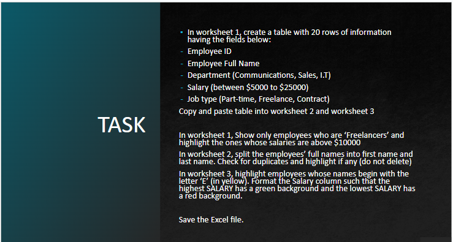
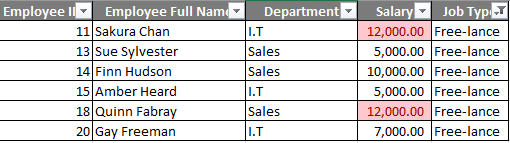
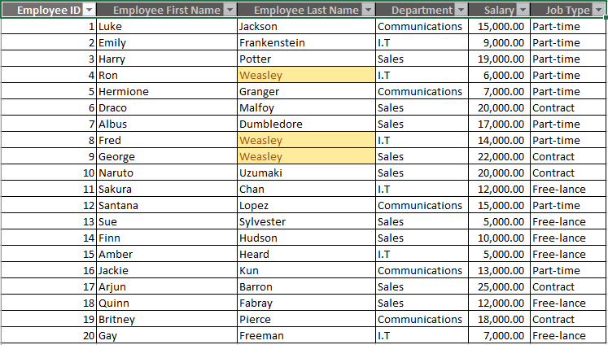
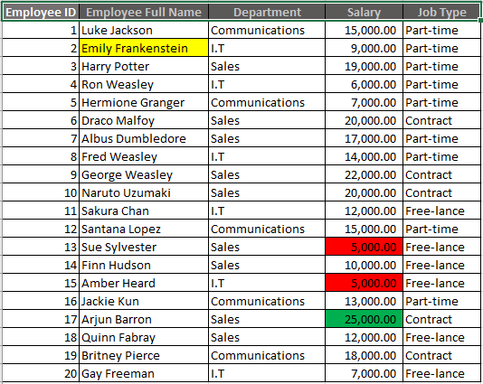

# Company-Employee-details-analysis

## Introduction
As one of the first steps in my data analysis journey, I have been given the task to create a dataset consisting of employee details for an imaginary company and carry out data management and manipulation with Microsoft Excel.

**_DISCLAIMER_**: _All the information contained in this dataset does not represent any individual or company but just a dummy dataset to demonstrate data management and manipulation with Microsoft Excel._

## Skills demonstrated

The following Excel features were utilized-
- Sorting,
- Filtering,
- Text-to-columns,
- Conditional formatting

## Analysis
Worksheet 1 below was filtered to show only freelancers and those that earn above $10,000 are highlighted using conditional formatting as instructed.

The text-to-column feature was used to split the employees’ full names into first name and last name in worksheet 2 below. Conditional formatting was also used to highlight the duplicate names.

For worksheet 3, conditional formatting was used to highlight the only employee whose name begins with the letter ‘E’ in yellow. The salary column was also formatted such that the highest salary has a green background and the lowest salary has a red background.

## Conclusion
This exercise allowed me to explore some of the very important and useful features that will ensure accuracy and integrity in the data cleaning and analysis process. 
